# Zidipay Policy RAG

A Retrieval-Augmented Generation (RAG) web app that answers questions about the policies and procedures of **Zidipay Financial Technologies**, a fictional East-African digital payments company. The corpus is 100% synthetic but internally consistent. Every answer is grounded in the corpus and shipped with inline `[n]` citations linked to the source document and section.

Stack: **Python 3.11 · Flask · LangChain · Groq `llama-3.3-70b-versatile` · HuggingFace `BAAI/bge-small-en-v1.5` embeddings · Chroma · Docker (Hugging Face Spaces)**.

The corpus is **14 documents, 126 chunks** after ingestion: 9 Markdown, 2 HTML, 2 PDF, 1 plain text. Topics covered: Employee Handbook, PTO & Leave, Remote/Hybrid Work, Information Security, Acceptable Use & Device Policy, Data Protection & Privacy, Expense & Reimbursement, Travel, AML/KYC, Anti-Bribery & Code of Conduct, Performance Review & Promotion, Onboarding & Offboarding, Incident Response & Business Continuity, Public Holidays & Working Hours.

## Architecture

```mermaid
flowchart LR
    A[corpus/<br/>md · html · pdf · txt] --> B[loaders<br/>rag/loaders.py]
    B --> C[chunker<br/>MarkdownHeaderTextSplitter +<br/>RecursiveCharacterTextSplitter]
    C --> D[embeddings<br/>BAAI/bge-small-en-v1.5]
    D --> E[(Chroma<br/>data/chroma)]
    F[user question] --> G[retriever<br/>top_k=8 · k_fetch=15]
    E --> G
    G --> H{score gate<br/>≥ 0.25?}
    H -- no --> R[refusal]
    H -- yes --> I[optional rerank<br/>ms-marco-MiniLM-L-6-v2]
    I --> J[prompt builder<br/>numbered context blocks]
    J --> K[ChatGroq<br/>llama-3.3-70b-versatile<br/>temperature=0]
    K --> L[citation parser<br/>extract n markers]
    L --> M[Flask API + UI<br/>/ · /chat · /health · /source]
```



The pipeline is imperative (`rag/pipeline.py`) — retrieve → format → call → parse — not a LangChain "chain". This keeps every stage independently testable.

## Routes

- `GET /` — chat UI with suggestion buttons. The page renders the answer text and a citations panel; `[n]` markers in the answer are visually linked to the citation cards.
- `POST /chat` with JSON `{"question": "..."}` → `{"answer", "citations": [{doc_id, doc_title, section, source, snippet}], "latency_ms", "refused"}`. Snippets are capped at 320 characters.
- `GET /health` → `{"status": "ok", "model": "llama-3.3-70b-versatile", "index_chunks": 126}`.
- `GET /source/<doc_id>` — serves the raw corpus document with the correct MIME type so citation links open the original file.

## Guardrails

Refusals are enforced in two layers:

1. **Retrieval-score gate.** If the best similarity score across retrieved chunks is below `SCORE_THRESHOLD` (default `0.25`), the pipeline refuses immediately — **without calling the LLM**. Cheapest and most reliable.
2. **System-prompt instruction.** The LLM is instructed to answer only from the numbered context blocks and to reply with the exact refusal string when context is insufficient.

Refusal text (exact): `I can only answer questions about Zidipay's policies and procedures.`

## Citations

Each citation is a structured object: `{doc_id, doc_title, section, source, snippet}`. `[n]` markers in the answer correspond to numbered context blocks shown to the LLM, and the renderer pairs each marker with its citation card.

**Fallback:** if the model omits `[n]` markers entirely, the pipeline cites every retrieved chunk rather than returning an empty list. This is intentional — it over-cites instead of under-citing, so the user can still verify the answer.

## Optional re-ranker

A cross-encoder re-ranker (`cross-encoder/ms-marco-MiniLM-L-6-v2`) is implemented in [rag/retriever.py](rag/retriever.py) and toggled by `USE_RERANKER`. It is **disabled in the deployed instance** (CPU tier, model download not pre-cached on the live Space). The code path is complete and unit-tested; it is not exercised in the current eval numbers.

## Setup

```bash
python -m venv .venv
. .venv/bin/activate            # Windows: .venv\Scripts\activate
pip install -r requirements.txt
cp .env.example .env            # then edit and add your GROQ_API_KEY
```

## Run locally

```bash
python run_ingest.py            # build the Chroma index from corpus/
python app.py                   # Flask on http://localhost:5000
# or for production-style: gunicorn -b 0.0.0.0:7860 app:app
```

Open `http://localhost:5000` and ask e.g. *"How many days of annual leave do I get?"*. The first ingest run downloads the embedding model (~130 MB) into the HuggingFace cache.

## Evaluation

```bash
python eval/run_eval.py                    # writes eval/results/summary.md + eval_results.json
python eval/run_eval.py --limit 3          # quick smoke (3 in-corpus + 1 out-of-corpus)
python eval/run_eval.py --ablate           # ablation sweep → eval/results/ablations.md
python eval/run_eval.py --model llama-3.1-8b-instant
```

Output files:

- `eval/results/summary.md` — headline metrics table (groundedness, citation accuracy, refusal correctness, latency p50/p95).
- `eval/results/eval_results.json` — per-question detail (answer, citations, judge verdict, deterministic checks, latency).
- `eval/results/ablations.md` / `ablations.json` — produced when `--ablate` is passed.

The harness runs the full pipeline for every question, uses an LLM-as-judge (same model, temperature 0) for groundedness and "citation-supports-answer", runs a deterministic check that the expected `doc_id` and section keyword are in the citations, checks refusal correctness on the out-of-corpus subset, and reports latency p50/p95 over the in-corpus runs.

## Tests

```bash
pytest -q
```

The test suite uses a tiny in-memory fixture corpus and a stubbed Groq call, so it runs offline with no API key. Coverage:

- `tests/test_loaders.py` — multi-format loaders preserve `doc_id`, `doc_title`, `section`, `source`.
- `tests/test_chunking.py` — header-aware splitting on a sample markdown doc.
- `tests/test_retriever.py` — score normalisation and the `SCORE_THRESHOLD` gate.
- `tests/test_generate.py` — citation parsing, refusal contract, over-cite fallback.
- `tests/test_pipeline.py` — end-to-end with stub LLM.
- `tests/test_app.py` — Flask route smoke tests.

## Reproducibility

- `PYTHONHASHSEED`, `random.seed`, and `numpy.random.seed` are all pinned from `SEED` in [rag/config.py](rag/config.py) at import time.
- Generation `temperature=0` for both the answering LLM and the LLM judge in eval.
- Chunking parameters are deterministic; `run_ingest.py` produces the same chunks in the same order on every run.
- `requirements.txt` is fully pinned.
- The eval samples with a seeded RNG.

## Environment variables

| Variable | Default | Purpose |
| --- | --- | --- |
| `GROQ_API_KEY` | *(required at runtime)* | Groq API key for the LLM. |
| `GROQ_MODEL` | `llama-3.3-70b-versatile` | Primary model. Fallback: `llama-3.1-8b-instant`. |
| `EMBEDDING_MODEL` | `BAAI/bge-small-en-v1.5` | HuggingFace embeddings (local). |
| `RERANKER_MODEL` | `cross-encoder/ms-marco-MiniLM-L-6-v2` | Cross-encoder when `USE_RERANKER=true`. |
| `USE_RERANKER` | `false` | Toggle the cross-encoder re-ranker. Disabled in the deployed instance. |
| `TOP_K` | `8` | Number of chunks the LLM sees. Raised from 5 after the Q03 diagnostic — see design doc. |
| `K_FETCH` | `15` | Candidates fetched before rerank / cutoff. |
| `CHUNK_SIZE` | `1100` | Recursive splitter chunk size (chars). |
| `CHUNK_OVERLAP` | `150` | Recursive splitter overlap (chars). |
| `MAX_OUTPUT_TOKENS` | `512` | Generation length cap. |
| `SCORE_THRESHOLD` | `0.25` | Min top-1 similarity; below → refusal without calling the LLM. |
| `CHROMA_DIR` | `data/chroma` | Chroma persist directory. |
| `CORPUS_DIR` | `corpus` | Source documents. |
| `SEED` | `42` | RNG seed for reproducibility. |
| `PORT` | `5000` local / `7860` Docker | HTTP port. |

`TOP_K` defaults to `5` in [rag/config.py](rag/config.py) and is set to `8` in [.env.example](.env.example); the deployed Space uses `8`. The same value was used for the headline evaluation numbers.

## Deployment

Deployed on **Hugging Face Spaces (Docker SDK)**. The YAML header at the top of this README is the Space configuration. `GROQ_API_KEY` is set as a Space secret. The live URL is in [deployed.md](deployed.md).

CI/CD is split across `.github/workflows/ci.yml` and `.github/workflows/cd.yml`. CI runs on push/PR: installs dependencies, runs an import check, and `pytest -q`. CD pushes to the HF Space on a green build of `main` (via `workflow_run`).

## Notes / assumptions

- Zidipay is fictional. All policy contents, figures, contacts, and document IDs are invented but internally consistent.
- The cross-encoder reranker is off by default (CPU-only deployments). Turning it on adds noticeable per-query latency on the deployed tier.
- The Groq free tier is rate-limited; the eval harness sleeps between calls. If you hit the cap, switch `GROQ_MODEL` to `llama-3.1-8b-instant` or pass `--model llama-3.1-8b-instant` to the eval.
