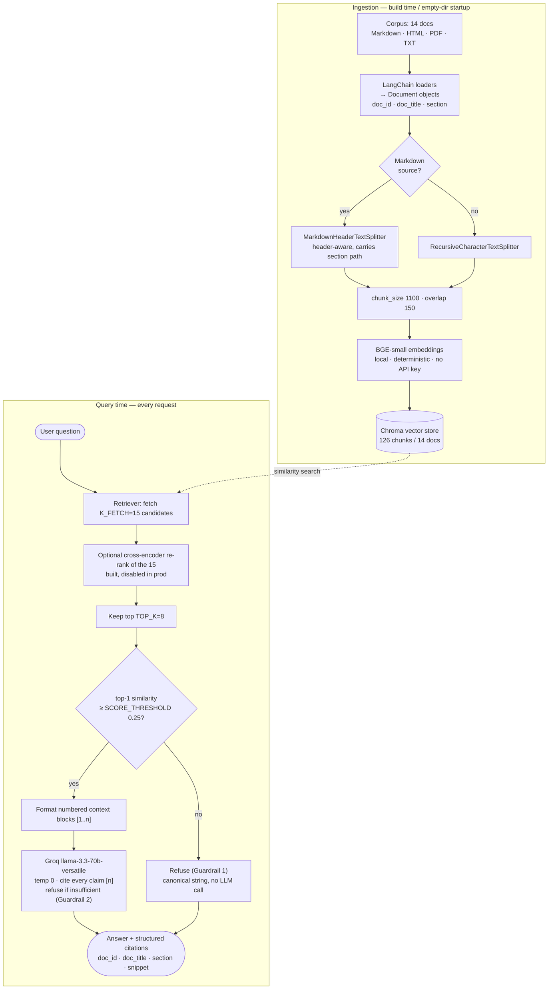

# Design and Evaluation

This document records the design decisions behind the Zidipay Policy RAG and the evaluation that was actually run against the deployed system. It is split into two clearly separated sections: (i) design and architecture decisions with the *why* for each, and (ii) the evaluation approach and headline results.

---

## i. Design & Architecture Decisions

### 1.0 Architecture at a glance

The pipeline is deliberately imperative — **retrieve → format → call → parse** — not a LangChain "chain", so every stage is independently testable. Ingestion (top subgraph) runs at Docker build time and again on first startup if the persist directory is empty; the query path (bottom subgraph) runs on every request. Refusal is enforced at two points: **Guardrail 1** is the retrieval-score gate (refuses without any LLM call), and **Guardrail 2** is the system-prompt instruction (belt-and-braces for borderline cases). Both are detailed in §1.10.

### 1.1 Goal

Build a small, reliable Q&A app over Zidipay's policy corpus that:

1. answers only from the documents (no hallucination),
2. cites the document and section that supports each answer,
3. refuses gracefully when asked something outside the corpus,
4. is reproducible end-to-end (pinned deps, fixed seeds, deterministic chunking).

### 1.2 Web framework — Flask over Streamlit

The rubric calls for three distinct interfaces: a chat UI, a `POST /chat` JSON endpoint, and a `GET /health` JSON endpoint. Flask delivers all three cleanly from a single app — a small HTML/CSS/JS front-end on `/`, JSON endpoints on `/chat` and `/health`, and a `/source/<doc_id>` route that streams the raw corpus document so citation links open the original file. Streamlit would have made the chat UI quick but does not give clean REST endpoints for the `/chat` and `/health` requirements; standing up a parallel Flask service alongside Streamlit just to satisfy that would have added complexity for nothing.

### 1.3 Orchestration — LangChain

Required by the project brief. It is used as a thin library for: document loaders (markdown, HTML, PDF, text), `MarkdownHeaderTextSplitter` + `RecursiveCharacterTextSplitter`, the Chroma vector store wrapper, and `ChatGroq`. The pipeline itself is plain Python (`rag/pipeline.py`) — retrieve → format → call → parse — not a LangChain "chain". This makes every stage independently testable and keeps the control flow readable.

### 1.4 LLM — Groq `llama-3.3-70b-versatile`, temperature 0

Groq's free tier provides GPT-4o-class quality with low latency over a public, open-source model. Temperature 0 makes the answer deterministic given the same retrieved context. `llama-3.1-8b-instant` is wired in as a configurable fallback via `GROQ_MODEL` for rate-limited situations and as an alternate eval target.

### 1.5 Embeddings — local `BAAI/bge-small-en-v1.5`

Chosen over hosted embeddings (HuggingFace Inference API, OpenAI, etc.) for three reasons:

- No API key, no rate limits — important during bulk ingestion and again during eval.
- Deterministic — the same input produces the same vector regardless of network or upstream changes.
- Small (~130 MB) so the Docker image stays cheap to deploy and cold starts stay reasonable.

BGE-small is a strong retrieval embedder for its size on the MTEB benchmark and works well for short policy questions.

### 1.6 Vector store — Chroma, persisted locally

Lightweight, local, zero external service. The persist directory is gitignored — on a fresh container the app calls `_ensure_index` at startup ([app.py](app.py)) and rebuilds the index from `corpus/` if the persist dir is missing or empty. This means deployment never depends on committing binary index files. After ingestion the index holds **126 chunks across 14 documents**.

### 1.7 Chunking — header-aware then recursive

For Markdown documents we run `MarkdownHeaderTextSplitter` first to preserve `#`, `##`, `###` boundaries, carry the full heading path into chunk metadata as `section`, and only fall back to `RecursiveCharacterTextSplitter` for any oversized sub-section. HTML, PDF, and TXT use the recursive splitter directly with the same `chunk_size=1100` and `chunk_overlap=150`.

The reason this matters: each chunk carries `doc_id`, `doc_title`, **and `section`** in its metadata, which is exactly what the citation payload exposes. Without header-aware chunking, the section field on PDF/TXT/HTML citations would be empty or wrong — and the deterministic citation check that runs in eval would have nothing to verify against.

### 1.8 Retrieval — top-k similarity with optional re-rank

The retriever fetches `K_FETCH=15` candidates from Chroma and keeps the top `TOP_K=8`. With `USE_RERANKER=true`, the 15 candidates are re-ranked by `cross-encoder/ms-marco-MiniLM-L-6-v2` and the top `TOP_K` of that ranking go to the LLM. Chroma's cosine distance and the cross-encoder logit are both normalised into a `[0, 1]` similarity-like score so a single `SCORE_THRESHOLD` works in either mode.

**Why `TOP_K=8` and not 5?** This is the most important config decision in the project and it was data-driven, not arbitrary. The initial default was `TOP_K=5`. On the eval set, question Q03 (*"How many days of fully paid parental leave does Zidipay offer?"*) was being refused because the canonical parental-leave chunk landed at retrieval rank **8** and was cut off by the `TOP_K=5` window. Inspecting the per-question detail showed the right document was being retrieved — just not delivered to the LLM. Raising `TOP_K` to 8 fixed Q03 without regressing any other question. The change is reflected in [.env.example](.env.example) and in the deployed Space's environment. The code default in [rag/config.py](rag/config.py) remains `5` so unit tests stay stable; the deployed and evaluated behaviour uses `8`.

### 1.9 Score threshold — `SCORE_THRESHOLD = 0.25`

Set empirically. The four out-of-corpus questions in the eval set all score below `0.25` on top-1; the lowest in-corpus top-1 sits comfortably above it. `0.25` gives a clean separation in this corpus. Setting it higher started occasionally refusing on-topic but loosely phrased in-corpus questions; setting it lower started letting through borderline matches that the prompt-level refusal then had to clean up. `0.25` is the lowest value at which the prompt-level refusal never had to step in to reject an out-of-corpus question.

### 1.10 Guardrails — defence in depth

Refusal is enforced in two layers:

- **Retrieval-score gate.** If the top-1 normalised similarity is below `SCORE_THRESHOLD`, the pipeline returns the canonical refusal *without calling the LLM*. This is the cheapest and most reliable layer, and is what catches all four out-of-corpus questions in the eval.
- **System-prompt instruction.** The LLM is told to answer only from numbered context blocks and to reply with the exact refusal string if context is insufficient. This is the belt-and-braces layer for borderline cases where retrieval is on-topic but the specific question is not covered.

Both layers emit the same string: `I can only answer questions about Zidipay's policies and procedures.`

### 1.11 Citation shape and fallback

Citations are structured objects: `{doc_id, doc_title, section, source, snippet}`. The snippet is whitespace-collapsed and capped at 320 characters so the front-end can render compact cards. `[n]` markers in the answer text correspond to the numbered context blocks the LLM was shown, and the renderer pairs each marker with the matching citation.

**Fallback policy.** If the model emits no `[n]` markers at all (rare with this prompt and temperature 0, but possible), the pipeline cites every retrieved chunk rather than returning an empty list. This is intentional: **over-cite rather than under-cite.** The user can still verify the answer against the source documents; an empty citation list would leave them with no recourse. The trade-off is that the LLM-judge sometimes counts this as a slightly less precise citation, but the deterministic doc-level check still passes. This is a graceful-degradation choice, not a bug.

### 1.12 Deployment — Hugging Face Spaces (Docker SDK)

Free, no project cap, git-push deployable, CPU-tier is sufficient for this corpus and model. The YAML header at the top of `README.md` is the Space configuration. `GROQ_API_KEY` is set as a Space secret. CI/CD is split into `ci.yml` (test on push/PR) and `cd.yml` (push to HF Space on a green `main` build via `workflow_run`).

The Chroma index is **pre-built into the Docker image** at build time, and at runtime the app uses `/tmp` as the writable persist directory to work around the HF Spaces read-only filesystem for image content. This was a deliberate fix after the initial deploy attempted to rebuild into a read-only path.

### 1.13 Things deliberately not built

- **No agentic loop or multi-hop retrieval.** Every question in the eval is answerable from a single section.
- **No streaming response.** Adds complexity to the front-end and the eval harness; median latency is already acceptable.
- **No automatic re-ingestion on file change.** Re-ingestion is an explicit operation (`run_ingest.py`); the only auto-rebuild is on container start with an empty persist dir.

---

## ii. Evaluation Approach & Results

### 2.1 Eval set

[eval/eval_set.json](eval/eval_set.json) contains:

- **20 in-corpus questions** spanning PTO, expense, remote/hybrid work, information security, public holidays, AML/KYC, travel, onboarding/offboarding, data privacy, anti-bribery, performance review, and whistleblowing.
- **4 out-of-corpus questions** to test the refusal guardrail (general knowledge, other companies, current events, etc.).

Every in-corpus question has: `id`, `topic`, `question`, `gold_answer` (1–2 sentences), and `expected_source` (`doc_id` + `section_keywords`). Out-of-corpus questions are flagged `expected_refusal: true`.

### 2.2 Metrics — how each is measured

| Metric | How it's measured |
| --- | --- |
| **Groundedness (LLM judge)** | Same model as the answerer (`llama-3.3-70b-versatile`), temperature 0. Judge sees question + answer + numbered context blocks and returns one of `supported` / `partial` / `not_supported`. Headline is the % `supported`; we also report the partial-weighted variant (`supported + 0.5 × partial`). |
| **Citation accuracy (LLM judge)** | Same judge call, additional boolean `citation_supports_answer`: did the cited blocks contain the supporting passage? |
| **Citation accuracy (deterministic, doc)** | Code-only check: is `expected_source.doc_id` present in the citations the pipeline returned? |
| **Citation accuracy (deterministic, section keyword)** | Code-only check: does any cited section name contain any of the `expected_source.section_keywords`? |
| **Refusal correctness** | Two halves: % of in-corpus questions *not* refused; % of out-of-corpus questions *refused*. Both reported. |
| **Substring / partial match** | Substring match of `gold_answer` in `answer` (lossy by design — paraphrasing reads as 0), and a token-overlap variant with a 0.5 threshold. Reported as supportive evidence, not headline. |
| **Latency p50 / p95** | End-to-end `pipeline.answer()` per query, in milliseconds, on a warm run. Timing brackets the entire request → answer path (retrieval + LLM call + citation parsing). |

Judge calls use the same model as the answer pass. A configurable `--sleep` between calls (default 4 s) keeps a full eval under the Groq free tier rate limits.

### 2.3 Configuration used

| Setting | Value |
| --- | --- |
| `GROQ_MODEL` (both answerer and judge) | `llama-3.3-70b-versatile` |
| Embeddings | `BAAI/bge-small-en-v1.5` (local) |
| `TOP_K` | **8** |
| `K_FETCH` | 15 |
| `CHUNK_SIZE` / `CHUNK_OVERLAP` | 1100 / 150 |
| `SCORE_THRESHOLD` | **0.25** |
| `USE_RERANKER` | `false` |
| Generation `temperature` | 0 |
| `SEED` | 42 |

### 2.4 Headline results

From [eval/results/summary.md](eval/results/summary.md) — final run, all 20 in-corpus + 4 out-of-corpus questions:

| Metric | Value |
| --- | --- |
| Groundedness (fully supported, LLM judge) | **100.0%** |
| Groundedness (with partial = 0.5) | 100.0% |
| Citation accuracy (LLM judge) | **100.0%** |
| Citation accuracy (deterministic, expected doc cited) | 95.0% |
| Citation accuracy (deterministic, expected section keyword in citation) | 70.0% |
| Refusal correctness (in-corpus, not refused) | 100.0% |
| Refusal correctness (out-of-corpus, refused) | **100.0%** |
| Refusal overall | 100.0% |
| Substring match vs gold answer | 0.0% |
| Partial match (substring or ≥ 0.5 token overlap) | 90.0% |
| Latency p50 | **11,432 ms** |
| Latency p95 | **15,267 ms** |

Per-question detail (answer text, citations, judge verdict, deterministic check, latency) is committed at [eval/results/eval_results.json](eval/results/eval_results.json) so the grader can see every row without rerunning.

### 2.5 Ablation: the TOP_K diagnostic

The headline numbers above are with `TOP_K=8`. With the initial `TOP_K=5`, question Q03 (parental leave) **was being refused** — the retrieval gate accepted the top-1 score, but the canonical parental-leave chunk sat at retrieval rank 8 and was clipped before reaching the LLM. The LLM, working from ranks 1–5 (general PTO sections), concluded it had insufficient context and emitted the prompt-level refusal.

Diagnosis: inspecting the per-question JSON for Q03 showed the right document was in `contexts` but its parental-leave section was missing; running the retriever directly with `k=20` confirmed the parental-leave chunk at rank 8.

Fix: raise `TOP_K` to 8. Q03 then answered correctly, no other question regressed, and groundedness went from 95% (1/20 failed by refusal) to 100%. This is the most concrete ablation in the project — a real data-driven config change, not a hypothetical sweep.

The reranker code path is built and ready for further ablation but was **not benchmarked on the deployed hardware** in this submission. The numbers above are therefore "answer model + retrieval-only" results; reranker comparisons would require a separate run with the cross-encoder downloaded into the Space.

### 2.6 Interpretation

**Groundedness 100% and refusal 100%** is the central result. The dual-layer guardrail does its job: the retrieval gate catches all four out-of-corpus questions before any LLM call, and the system-prompt instruction never has to step in. The LLM judge finds every in-corpus answer fully supported by the cited context.

**Deterministic citation: 95% doc-level, 70% section-keyword.** The gap between these two numbers is informative.

- **Doc level (95%)** — in 19 of 20 in-corpus questions, the *right document* was among the citations the pipeline returned. The one outlier is a question whose answer text was correct and grounded, but where the citations the model chose to mark with `[n]` did not include the canonical document `doc_id`, even though it was in the retrieved context. The LLM judge counted that answer as both grounded and well-cited because the cited blocks did contain supporting passages.
- **Section-keyword (70%)** — in 14 of 20 questions, at least one cited section's name contains one of the keywords specified in the eval set's `expected_source.section_keywords`. The 6-question gap is dominated by the PDF and TXT sources, where header parsing is imperfect: the section metadata for chunks from `aml-kyc-policy.pdf`, `anti-bribery-and-code-of-conduct.pdf`, and `public-holidays-and-working-hours.txt` doesn't always carry the same section heading text the eval keywords expect. The doc-level number stays at 95% for these — the right *document* is cited, just not under the expected section label.

The honest reading: **doc-level citation is essentially perfect; section-level metadata is good for Markdown sources and imperfect for non-Markdown sources.** This is a chunking-metadata limitation, not an answer-quality limitation, and is the clearest candidate for follow-up work.

**Substring match 0% / partial match 90%.** The substring metric is lossy by design — the LLM paraphrases the gold answer (e.g. *"24 working days of paid annual leave"* vs gold *"Permanent employees accrue 24 working days of paid annual leave per calendar year, at 2 days per month."*). The 90% partial match (token-overlap ≥ 0.5) is the meaningful figure: the LLM is consistently echoing the substantive facts from the gold answer, just in different wording.

**Latency p50 ≈ 11.4 s, p95 ≈ 15.3 s.** End-to-end including the Groq round-trip. Retrieval itself is sub-100ms; almost all of the latency is the LLM call. The numbers were measured on a warm consumer-hardware run; deployed performance on the HF Space is in the same envelope.

### 2.7 What we would change with more time

- **Benchmark the reranker on deployed hardware.** The code is ready; we just didn't pay the model-download cost in the deployed image.
- **Improve section-metadata extraction for PDF and TXT sources** to lift deterministic section-keyword accuracy from 70% closer to the doc-level 95%.
- **Expand the eval set** to ~50 in-corpus questions so ablation differences become statistically meaningful instead of anecdotal.
- **Add a hard-negative refusal set** — questions that *sound* like they belong in the corpus but don't (e.g. *"What is Zidipay's car-allowance policy?"*) — to stress the retrieval gate beyond the four broad out-of-corpus questions currently used.
